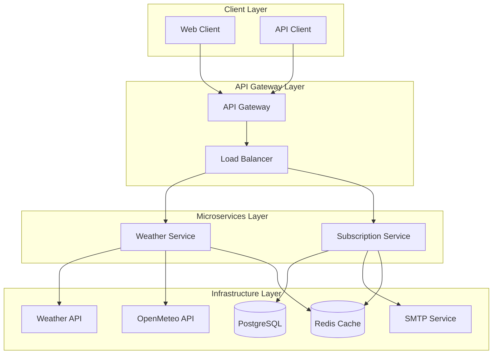

##  Table of Contents

- [ Overview](#-overview)
- [ Features](#-features)
- [ Architecture](#-architecture)
- [ Project Structure](#-project-structure)
- [ Getting Started](#-getting-started)
  - [ Prerequisites](#-prerequisites-for-docker-build)
  - [ Prerequisites in dev](#-+-prerequisites-for-dev-mode-with-a-database-in-docker)
  - [ Installation](#-install-repository)
  - [ Testing](#-testing)

---

##  Overview

### **Weather Forecast Microservices** is a NestJS-based microservices system that:

- **API Gateway**: Single entry point for all client requests with routing and load balancing
- **Weather Service**: Fetches real-time weather data from multiple providers (WeatherAPI.com, OpenMeteo)
- **Subscription Service**: Manages user subscriptions and email delivery with scheduled updates
- **Shared Infrastructure**: PostgreSQL database, Redis cache, and SMTP email service
- **Fully containerized** with Docker + Docker Compose
- **gRPC communication** between microservices for high performance
- **Comprehensive testing** with Jest and Playwright
- **Production deployment** available at [view deployment](https://genesis-test-assignment-production.up.railway.app/api/)

---

##  Features

❯ 🌐 **API Gateway**  
   — Single entry point for all requests  
   — Request routing to microservices  
   — Load balancing and rate limiting  
   — Swagger documentation  

❯ ✉️ **Subscription Workflow**  
   — `POST /subscribe` (form-data: *email*, *city*, *frequency*)  
   — `GET  /confirm/{token}` → confirm subscription  
   — `GET  /unsubscribe/{token}` → instant opt-out  

❯ ☀️ **Weather Service**  
   — `GET /weather?city=Kyiv` returns weather data  
   — Multiple weather provider support  
   — Intelligent caching with Redis  
   — Provider fallback mechanism  

❯ 🗓 **Scheduler**  
   — CRON `0 * * * *` → sends *hourly* emails  
   — CRON `0 9 * * *` → sends *daily* emails at 09:00 UTC+0  
   — Batched by city: only one WeatherAPI call per unique location  

❯ 🛠 **Developer-friendly**  
   — Hot reload in dev mode  
   — Comprehensive test suite  
   — ESLint + Prettier  
   — Docker development environment  

---

##  Architecture



---

##  Project Structure

```sh
└── genesis-test-assignment/
    ├── apps/
    │   ├── api-gateway/           # API Gateway service
    │   │   ├── src/
    │   │   │   ├── subscription/  # Subscription endpoints
    │   │   │   ├── weather/       # Weather endpoints
    │   │   │   └── main.ts
    │   │   └── test/
    │   ├── weather/               # Weather microservice
    │   │   ├── src/
    │   │   │   ├── modules/
    │   │   │   │   ├── weather/   # Weather logic
    │   │   │   │   └── metrics/   # Monitoring
    │   │   │   └── main.ts
    │   │   └── test/
    │   └── subscription/          # Subscription microservice
    │       ├── src/
    │       │   ├── modules/
    │       │   │   ├── subscription/  # Subscription logic
    │       │   │   ├── email/         # Email service
    │       │   │   └── scheduler/     # Scheduled jobs
    │       │   ├── migrations/        # Database migrations
    │       │   └── main.ts
    │       └── test/
    ├── libs/
    │   └── common/               # Shared libraries
    │       ├── src/
    │       │   ├── types/        # Shared types and DTOs
    │       │   ├── mappers/      # Data mappers
    │       │   └── errors/       # Error handling
    ├── proto/                    # gRPC protocol buffers
    ├── public/                   # Static web pages
    ├── documents/                # Architecture documentation
    ├── docker-compose.yml        # Development environment
    ├── docker-compose.test.yml   # Testing environment
    └── README.md
```

---
##  Getting Started

###  Prerequisites for docker build

Before getting started with genesis-test-assignment, ensure your runtime environment meets the following requirements:

- **Node.js:** [version 22 LTS](https://nodejs.org/en)
- **Container Runtime:** [Docker](https://www.docker.com/)

###  + Prerequisites for dev mode with a database in docker
- **Nest cli:**
```sh
npm install -g @nestjs/cli
```
- **Package Manager:** Pnpm
```sh
npm install -g pnpm
```

###  Install repository

**Build from source:**

1. Clone the genesis-test-assignment repository:
```sh
git clone https://github.com/Kyryloloshka/genesis-test-assignment
```

2. Navigate to the project directory:
```sh
cd genesis-test-assignment
```

3. Install dependencies:
```sh
pnpm install
```

4. Set up environment variables:
```sh
# Create environment files for each service
cp apps/weather/.env.example apps/weather/.env
cp apps/subscription/.env.example apps/subscription/.env

# Edit the files with your configuration
```

5. Build and start all services with Docker Compose:
```sh
docker compose up --build
```

6. Open the API documentation at `localhost:5000/api/`

**Development mode:**

1. Start the development environment:
```sh
# Start infrastructure services (PostgreSQL, Redis)
docker compose up postgres redis -d

# Run database migrations
pnpm migration:run

# Start all services in development mode
pnpm start:all:dev
```

2. Access the services:
   - API Gateway: `localhost:3000/api/`
   - Weather Service: `localhost:3001/`
   - Subscription Service: `localhost:3002/`
   - Health checks: `localhost:3000/health`, `localhost:3001/health`, `localhost:3002/health`

###  Testing

#### Integration Tests
To run integration tests for all services:

```bash
pnpm test
```

#### E2E Tests
To run E2E tests with Playwright:

```bash
pnpm test:e2e
```

#### Architecture Tests
To run architecture compliance tests:

```bash
pnpm test:arch
```

#### Service-specific Tests
```bash
# Test API Gateway
cd apps/api-gateway && pnpm test

# Test Weather Service
cd apps/weather && pnpm test

# Test Subscription Service
cd apps/subscription && pnpm test
```

---

##  Service Communication

### gRPC Protocol
All inter-service communication uses gRPC with Protocol Buffers:

- **Weather Service**: Handles weather data requests
- **Subscription Service**: Manages subscriptions and email delivery
- **API Gateway**: Routes requests and handles client communication

### API Endpoints

#### Weather Service
- `GET /weather?city={city}` - Get current weather for a city

#### Subscription Service
- `POST /subscribe` - Create new subscription
- `GET /confirm/{token}` - Confirm subscription
- `GET /unsubscribe/{token}` - Unsubscribe

#### API Gateway
- All endpoints are proxied through the gateway
- Swagger documentation available at `/api/`

## Запуск фронтенду (Next.js)

З кореня проєкту використовуйте:

- `pnpm client:dev` — запуск у режимі розробки
- `pnpm client:build` — зібрати production-білд
- `pnpm client:start` — запустити production-сервер (після білду)

Фронтенд знаходиться у `apps/client`.

> Для роботи скриптів потрібен pnpm та налаштовані workspaces (налаштовано у цьому репозиторії).
