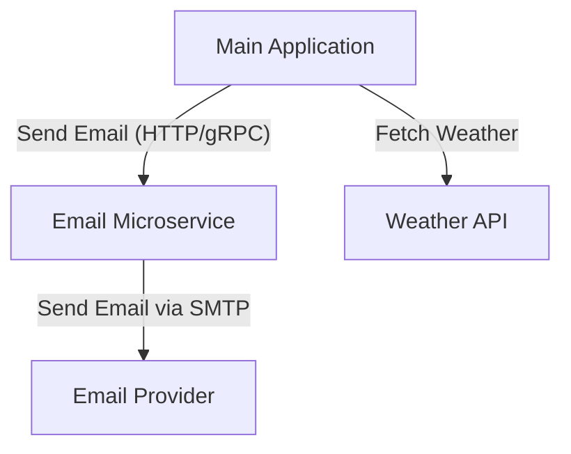

# Extracting the Email Microservice

## Motivation

The current monolithic application handles user subscriptions, weather data fetching, and email notifications within a single codebase. As the system grows, the email notification logic becomes a scalability and maintainability bottleneck. Extracting the email functionality into a dedicated microservice will improve reliability, scalability, and separation of concerns.

## Steps to Extract the Email Microservice

1. **Identify Email Logic**
   - Locate all code responsible for composing and sending emails (e.g., confirmation, weather updates).
   - Move this logic into a new repository or folder, e.g., `email-service`.

2. **Define Service Interface**
   - Design a clear API for the new service. The main application will send email tasks (recipient, subject, body, etc.) to this interface.
   - Two main options for communication:
     - **HTTP REST API** (e.g., POST `/send-email`)
     - **gRPC API** (e.g., `SendEmail` RPC method)

3. **Compare HTTP vs gRPC**

   | Aspect           | HTTP REST API                        | gRPC                                 |
   |------------------|--------------------------------------|--------------------------------------|
   | **Simplicity**   | Very simple, easy to implement       | Requires proto definitions and code generation |
   | **Interoperability** | Supported by any language, easy to test with curl/Postman | Best for internal services, needs gRPC clients |
   | **Performance**  | Text-based, slightly slower          | Binary protocol, faster and more efficient |
   | **Error Handling** | Standard HTTP status codes          | Rich error model, but less familiar for web devs |
   | **Streaming**    | Not native, needs workarounds        | Native support for streaming         |
   | **Tooling**      | Mature, lots of tools                | Good, but requires proto tooling     |

   - For simple, low-load scenarios or when interoperability is important, **HTTP REST** is preferred.
   - For high-performance, internal communication, or when you plan to scale, **gRPC** is a strong choice.

4. **Refactor Main Application**
   - Replace direct email sending with calls to the new microservice (via HTTP or gRPC).
   - Remove SMTP credentials and logic from the main codebase.

5. **Deployment**
   - Deploy the email microservice independently.
   - Ensure it can scale horizontally if needed.

## Resulting Architecture

- **Main Application:** Handles user subscriptions, weather data, and business logic.
- **Email Microservice:** Dedicated to composing and sending emails, exposes HTTP or gRPC API.
- **Weather API:** External service for weather data.

## Benefits

- **Scalability:** Email processing can be scaled independently.
- **Reliability:** Failures in email sending do not affect the main app.
- **Maintainability:** Clear separation of concerns and easier codebase management.
- **Extensibility:** New notification channels (SMS, push) can be added as separate services.

---

**Next Steps:**  
- Decide on HTTP or gRPC for service communication.
- Implement the chosen API in the email microservice.
- Move all email-related code to the new microservice.
- Update deployment scripts and documentation.