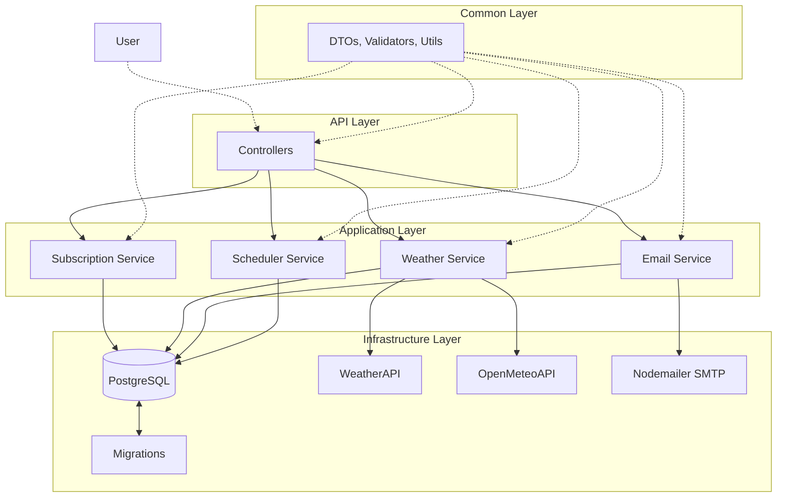

```mermaid
flowchart TD
    subgraph API Layer
        API[Controllers]
    end

    subgraph Application Layer
        SubscriptionService[Subscription Service]
        WeatherService[Weather Service]
        EmailService[Email Service]
        SchedulerService[Scheduler Service]
    end

    subgraph Infrastructure Layer
        DB[(PostgreSQL)]
        WeatherAPI[WeatherAPI]
        OpenMeteoAPI[OpenMeteoAPI]
        SMTP[Nodemailer SMTP]
        Migrations[Migrations]
    end

    subgraph Common Layer
        Utils[DTOs, Validators, Utils]
    end

    User -.-> API
    API --> SubscriptionService
    API --> WeatherService
    API --> EmailService
    API --> SchedulerService

    SubscriptionService --> DB
    WeatherService --> DB
    EmailService --> DB
    SchedulerService --> DB

    WeatherService --> WeatherAPI
    WeatherService --> OpenMeteoAPI
    EmailService --> SMTP
    DB <--> Migrations

    Utils -.-> API
    Utils -.-> SubscriptionService
    Utils -.-> WeatherService
    Utils -.-> EmailService
    Utils -.-> SchedulerService
```