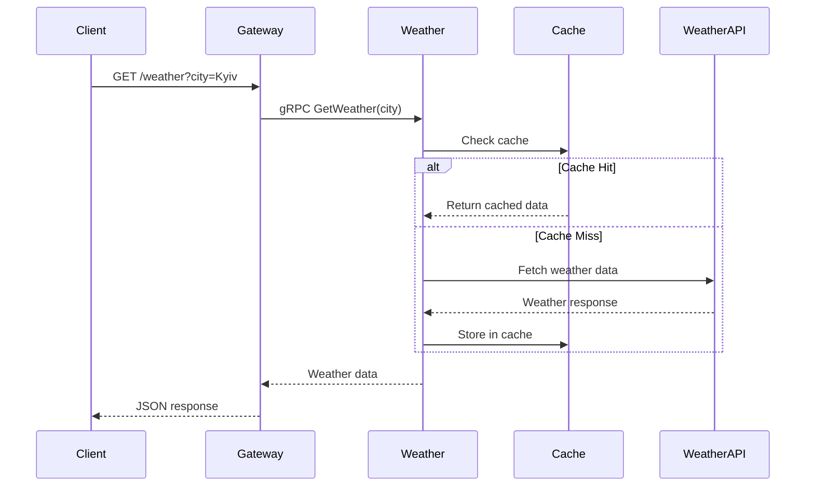
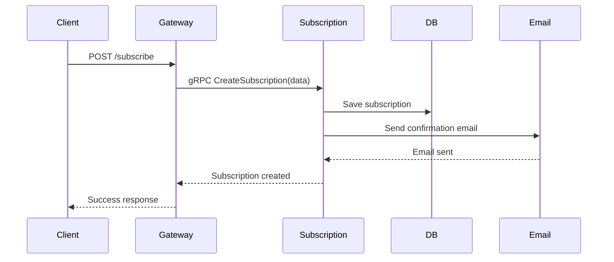
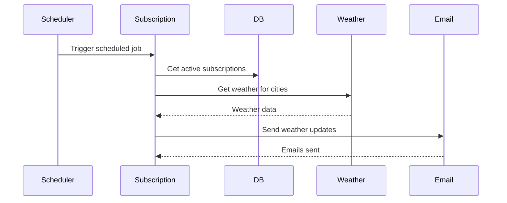

# Microservices Architecture Documentation

## Overview

This document describes the microservices architecture of the Weather Forecast system, which has been decomposed into three main services: API Gateway, Weather Service, and Subscription Service.

## Architecture Principles

### 1. Single Responsibility Principle
Each service has a single, well-defined responsibility:
- **API Gateway**: Request routing and client communication
- **Weather Service**: Weather data management and caching
- **Subscription Service**: User management and email delivery

### 2. Loose Coupling
Services communicate through well-defined interfaces using gRPC and Protocol Buffers, allowing independent development and deployment.

### 3. High Cohesion
Related functionality is grouped together within each service, minimizing cross-service dependencies.

## Service Details

### API Gateway (`apps/api-gateway`)

**Purpose**: Single entry point for all client requests

**Responsibilities**:
- Route requests to appropriate microservices
- Handle authentication and authorization
- Rate limiting and request validation
- API documentation (Swagger)
- Error handling and logging
- Load balancing

**Key Components**:
- `subscription.controller.ts` - Subscription endpoints
- `weather.controller.ts` - Weather endpoints
- `subscription.service.ts` - gRPC client for subscription service
- `weather.service.ts` - gRPC client for weather service

**Port**: 3000 (external: 5000)

### Weather Service (`apps/weather`)

**Purpose**: Handle all weather-related operations

**Responsibilities**:
- Fetch weather data from external APIs
- Cache weather data for performance
- Provide weather endpoints
- Handle weather data formatting
- Weather provider fallback logic

**Key Components**:
- `weather.controller.ts` - Weather API endpoints
- `weather.service.ts` - Business logic
- `providers/` - Weather API providers
- `metrics/` - Service monitoring
- `decorator/` - Caching and logging decorators

**Port**: 3001

**External Dependencies**:
- WeatherAPI.com
- OpenMeteo API
- Redis (caching)

### Subscription Service (`apps/subscription`)

**Purpose**: Handle all subscription and email operations

**Responsibilities**:
- User subscription management
- Email sending and template management
- Scheduled weather updates
- Database operations
- Email confirmation workflows

**Key Components**:
- `subscription.controller.ts` - Subscription endpoints
- `subscription.service.ts` - Business logic
- `email/` - Email service and templates
- `scheduler/` - Scheduled job processing
- `migrations/` - Database migrations

**Port**: 3002

**External Dependencies**:
- PostgreSQL database
- SMTP service
- Redis (caching)
- Weather Service (for weather data)

## Communication Patterns

### Inter-Service Communication

**Protocol**: gRPC with Protocol Buffers
- High performance binary protocol
- Strong typing with protobuf schemas
- Bidirectional streaming support
- Built-in code generation

**Service Discovery**: Direct service-to-service calls
- Services communicate using container names in Docker network
- No external service discovery needed for current scale

**Data Format**: Structured messages via protobuf
- Type-safe communication
- Efficient serialization
- Backward compatibility

### External Integrations

**Weather APIs**: REST API calls
- WeatherAPI.com (primary)
- OpenMeteo API (fallback)
- Automatic failover mechanism

**Email Service**: SMTP via Nodemailer
- Template-based email generation
- Retry mechanism for failed deliveries
- Delivery tracking

**Database**: PostgreSQL with TypeORM
- Connection pooling
- Migration management
- Transaction support

**Cache**: Redis for performance optimization
- Weather data caching
- Session storage
- Rate limiting

## Data Flow Examples

### Weather Request Flow



### Subscription Flow



### Scheduled Email Flow



## Deployment Architecture

### Container Structure

```yaml
services:
  api-gateway:      # Port 5000 (external)
  weather-service:  # Port 3001 (internal)
  subscription-service: # Port 3002 (internal)
  postgres:         # Port 5435 (external)
  redis:           # Port 6379 (external)
  pgadmin:         # Port 5050 (external)
```

### Network Configuration

```yaml
networks:
  weather-network:
    driver: bridge
```

All services communicate through the `weather-network` bridge network, allowing internal communication while exposing only necessary ports externally.

## Scaling Strategy

### Horizontal Scaling

**API Gateway**: Can be scaled horizontally behind a load balancer
- Stateless service
- Session management via Redis
- Rate limiting per instance

**Weather Service**: Stateless service suitable for horizontal scaling
- Cache sharing via Redis
- No local state
- Provider failover for reliability

**Subscription Service**: Requires careful scaling considerations
- Database connection pooling
- Scheduled job coordination
- Email delivery tracking

### Database Scaling

**Read Replicas**: For read-heavy operations
**Connection Pooling**: Managed by TypeORM
**Migration Strategy**: Zero-downtime deployments

## Monitoring and Observability

### Health Checks

Each service exposes health check endpoints:
- `/health` - Basic health status
- `/ready` - Readiness for traffic
- `/metrics` - Prometheus metrics

### Logging

- Structured logging with correlation IDs
- Centralized log aggregation
- Request/response logging
- Error tracking

### Metrics

- Request rates and latencies
- Error rates and types
- Cache hit ratios
- Database connection pool status

## Security Considerations

### Authentication & Authorization

- API Gateway handles authentication
- JWT tokens for stateless auth
- Role-based access control

### Network Security

- Internal service communication over private network
- TLS for external communications
- Rate limiting and DDoS protection

### Data Security

- Environment variable management
- Database encryption at rest
- Secure SMTP configuration

## Development Workflow

### Local Development

1. Start infrastructure services: `docker compose up postgres redis`
2. Start services in dev mode:
   ```bash
   cd apps/api-gateway && pnpm start:dev
   cd apps/weather && pnpm start:dev
   cd apps/subscription && pnpm start:dev
   ```

### Testing Strategy

- **Unit Tests**: Per service with Jest
- **Integration Tests**: Service-to-service communication
- **E2E Tests**: Full system testing with Playwright
- **Architecture Tests**: Compliance with architectural rules

### Deployment Pipeline

1. **Build**: Create Docker images for each service
2. **Test**: Run comprehensive test suite
3. **Deploy**: Rolling deployment with health checks
4. **Monitor**: Verify system health and performance

## Future Enhancements

### Planned Improvements

1. **Service Mesh**: Implement Istio for advanced traffic management
2. **Event Sourcing**: Add event-driven architecture for better scalability
3. **CQRS**: Separate read and write models for better performance
4. **API Versioning**: Implement proper API versioning strategy
5. **Circuit Breaker**: Add resilience patterns for external dependencies

### Scalability Considerations

1. **Message Queue**: Add RabbitMQ/Kafka for async processing
2. **Distributed Tracing**: Implement Jaeger for request tracing
3. **Configuration Management**: Centralized configuration with Consul
4. **Service Discovery**: Dynamic service discovery for larger deployments 