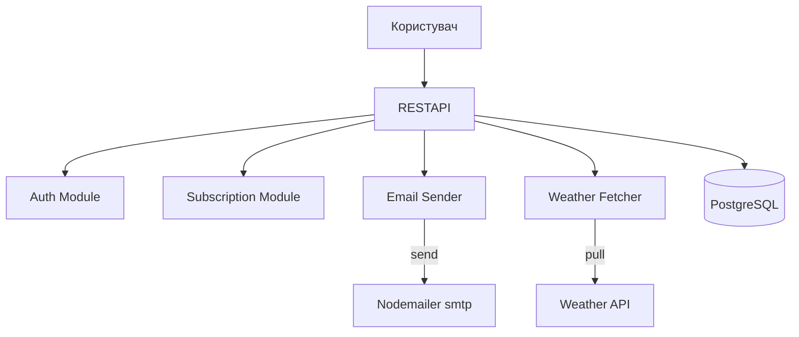

# System Design Document (SDD): Weather Forecast API

## 1. Description of the project 

This is a rest API service that allows users to subscribe to the city's weather forecast and receive an hour's upgrade or daily on Email. 

--- 

## 2. System requirements 

### 2.1 Functional requirements 

- User registration through Email. 
- Email confirmation (token). 
- subscription to the weather update (city + period). 
- change / delete subscription. 
- Sending the weather updates on Email according to subscription. 

### 2.2 non-functional requirements 

- Starting in Docker Composite. 
- High availability of service. 
- The possibility of horizontal scaling. 
- Treatment >= 1000 EMAIL-District/h. 
- Cover the main parts with tests. 
- Database migration when starting. 

### 2.3 Restrictions 

- Only Postgresql as a DBMS. 
- Weather data with Weatherapi.

---

## 3. The load estimate 

### 3.1 Users and Traffic 

- Number of users: up to 1000 active. 
- Requests: 10 req/sec on average.
- Peak load: ~20 req/sec 
- Email mailing: up to 1000 email/h. 

### 3.2 Data 

- Tables: Subscripts. 
- Database volume: up to 500 MB. 
- average volume of one request to API: <10 kb. 

### 3.3 The bandwidth 

- Integration with OpenWEATHER API: ~10k req/day. 
- Sending Email via SMTP: ~ 1000 Email/hour. 
- Input traffic: ~ 5–10 MB/day. 
- Outgoing traffic (email): ~ 50 MB/day.

---

## 4. High-Level Architecture

## 5. Технологічний стек

| Component | Technology | 
| ---------------------- | ----------------------------- | 
| API Framework | Nestjs (typescript) | 
| Orm | Typeorm | 
| DBMS | Postgresql | 
| Email Service | nodemailer | 
| Weather API | WeatherAPI | 
| Migration | Typeorm Migration CLI | 
| Testing | Jest | 
| Containerization | Docker + Docker Compose |

---

## 6. Detailed component design 

### 6.1 Subscription module 

- Creation, viewing, editing and deleting subscription. 
- Validation of the subscription interval (`Hourly`,` Daily`). 
- Binding to a specific user. 
- Storage in the Subscripts' table. 

### 6.2 Email Sender (Cron) 

- Search for active subscriptions by time. 
- Getting the current weather with Weather Fetcher. 
- Formation of the Email template. 
- Sending Email via SMTP. 

### 6.3 Weather Fetcher 

- Call Weather Api with the key. 
- Parsing response to a simplified structure. 
- (optional) Caching the answer for 10 minutes. 
- Error processing and timeouts. 

---
