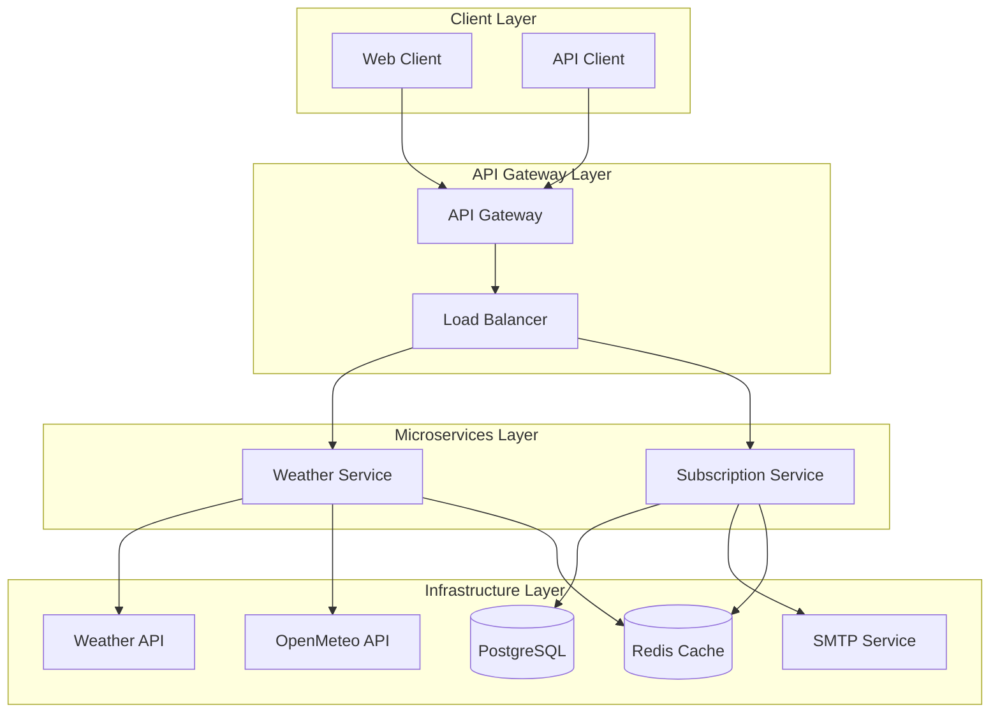

# System Design Document (SDD): Weather Forecast Microservices

## 1. Description of the project 

This is a microservices-based REST API system that allows users to subscribe to city weather forecasts and receive hourly or daily updates via email. The system is built using a microservices architecture with three main services: API Gateway, Weather Service, and Subscription Service.

--- 

## 2. System requirements 

### 2.1 Functional requirements 

- User registration through Email
- Email confirmation (token)
- Subscription to weather updates (city + period)
- Change/delete subscription
- Sending weather updates via Email according to subscription
- Real-time weather data fetching
- Caching for performance optimization

### 2.2 Non-functional requirements 

- Microservices architecture with Docker containers
- High availability and fault tolerance
- Horizontal scaling capability
- Processing >= 1000 emails/hour
- Comprehensive test coverage
- Database migrations on startup
- Service discovery and load balancing

### 2.3 Restrictions 

- PostgreSQL as primary database
- Redis for caching
- Weather data from WeatherAPI and OpenMeteo
- gRPC for inter-service communication

---

## 3. Load estimation 

### 3.1 Users and Traffic 

- Number of users: up to 1000 active
- Requests: 10 req/sec on average
- Peak load: ~20 req/sec 
- Email sending: up to 1000 emails/hour
- Weather API calls: ~10k req/day

### 3.2 Data 

- Tables: Subscriptions, Users
- Database volume: up to 500 MB
- Average request size: <10 KB
- Cache hit ratio: >80%

### 3.3 Bandwidth 

- Integration with Weather APIs: ~10k req/day
- Email via SMTP: ~1000 emails/hour
- Incoming traffic: ~5-10 MB/day
- Outgoing traffic (email): ~50 MB/day
- Inter-service communication: ~1-2 MB/day

---

## 4. High-Level Architecture

## 5. Technology Stack

| Component | Technology | 
|-----------|------------| 
| API Gateway | NestJS (TypeScript) | 
| Weather Service | NestJS (TypeScript) |
| Subscription Service | NestJS (TypeScript) |
| ORM | TypeORM | 
| Database | PostgreSQL | 
| Cache | Redis |
| Email Service | Nodemailer | 
| Weather APIs | WeatherAPI, OpenMeteo | 
| Inter-service Communication | gRPC + Protocol Buffers |
| Migration | TypeORM Migration CLI | 
| Testing | Jest + Playwright | 
| Containerization | Docker + Docker Compose |
| Service Discovery | Direct service calls |
| Load Balancing | API Gateway routing |

---

## 6. Detailed component design 

### 6.1 API Gateway (`apps/api-gateway`)

**Responsibilities:**
- Single entry point for all client requests
- Request routing to appropriate microservices
- Authentication and authorization
- Rate limiting and request validation
- API documentation (Swagger)
- Error handling and logging
- Load balancing

**Key Features:**
- gRPC client connections to microservices
- Request/response transformation
- Circuit breaker pattern implementation
- Request logging and monitoring

### 6.2 Weather Service (`apps/weather`)

**Responsibilities:**
- Fetch weather data from external APIs
- Cache weather data for performance
- Provide weather endpoints
- Handle weather data formatting
- Weather provider fallback logic

**Key Features:**
- Multiple weather provider support
- Intelligent caching strategy
- Provider failover mechanism
- Weather data normalization
- Metrics and monitoring

### 6.3 Subscription Service (`apps/subscription`)

**Responsibilities:**
- User subscription management
- Email sending and template management
- Scheduled weather updates
- Database operations
- Email confirmation workflows

**Key Features:**
- Subscription CRUD operations
- Email template system
- Scheduled job processing
- Database migrations
- Email delivery tracking

---

## 7. Data Flow

### 7.1 Weather Request Flow
1. Client → API Gateway
2. API Gateway → Weather Service (gRPC)
3. Weather Service → Cache check
4. If cache miss: Weather Service → External Weather APIs
5. Weather Service → Cache update
6. Weather Service → API Gateway
7. API Gateway → Client

### 7.2 Subscription Flow
1. Client → API Gateway
2. API Gateway → Subscription Service (gRPC)
3. Subscription Service → Database
4. Subscription Service → Email Service
5. Subscription Service → API Gateway
6. API Gateway → Client

### 7.3 Scheduled Email Flow
1. Scheduler → Subscription Service
2. Subscription Service → Database (get active subscriptions)
3. Subscription Service → Weather Service (get weather data)
4. Subscription Service → Email templates
5. Subscription Service → SMTP (send emails)

---

## 8. Deployment Strategy

### 8.1 Container Architecture
- Each service runs in its own Docker container
- Shared infrastructure services (PostgreSQL, Redis)
- Service-to-service communication via gRPC
- External service integrations via REST APIs

### 8.2 Scaling Strategy
- Horizontal scaling per service
- Load balancing at API Gateway level
- Database connection pooling
- Redis clustering for high availability

### 8.3 Monitoring and Observability
- Service health checks
- Request/response logging
- Performance metrics
- Error tracking and alerting
